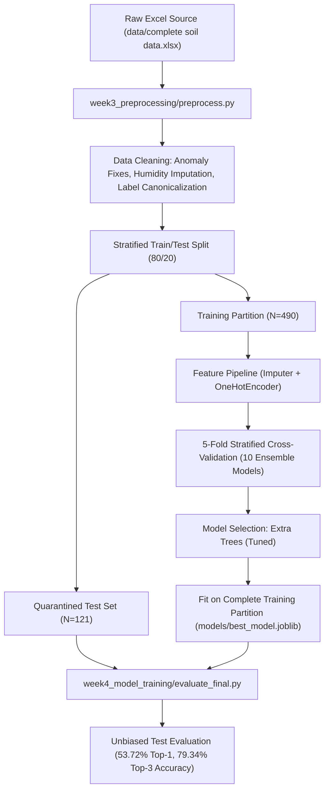

# Crop Recommendation Using Ensemble Techniques

[](https://www.python.org/)
[](https://opensource.org/licenses/MIT)
[]()

A scientifically rigorous, leakage-free machine learning framework for multi-class crop recommendation based on regional soil chemistry and agro-climatic conditions from the **Kadapa District (YSR District) of Andhra Pradesh, India**.

---

## 📌 Project Overview

Optimal crop selection is critical for agricultural productivity, sustainable soil management, and farmer livelihood. This project establishes an end-to-end, reproducible data-science pipeline that evaluates 10 ensemble classification architectures (Bagging, Boosting, Stacking, and Soft Voting) to recommend the most suitable crop among 34 candidate crops given laboratory soil test parameters and local environmental factors.

> [!IMPORTANT]
> **Geographic Scope & Domain Specificity:**  
> This dataset comprises empirical soil measurements from **Kadapa district, Andhra Pradesh, India** (covering 27 Mandals and 82 Villages in the semi-arid Rayalaseema agro-climatic zone). The model is specifically tuned to this regional soil chemistry (alkaline red sandy loams, black clay vertisols) and climate ($30–40^\circ\text{C}$, $600–900\text{ mm}$ rainfall). It is **not universally suitable** for other agro-climatic zones without localized retraining.

---

## 📊 Dataset & Feature Architecture

- **Primary Source:** `data/complete soil data.xlsx` (treated as strictly read-only; never modified).
- **Observations:** 611 authentic farm soil testing records (490 training, 121 independent test).
- **Input Features (27 ML features post-pipeline):**
  - **15 Continuous Soil & Agro-Climatic Features:** `PH`, `EC` (Salinity), `OC` (Organic Carbon), `N` (Nitrogen), `P2O5` (Phosphorus), `K20` (Potassium), `S` (Sulfur), `CU` (Copper), `FC` (Available Iron / Ferric Content), `MN` (Manganese), `ZN` (Zinc), `BA` (Available Boron), `Temparature`, `Humidity`, `Rainfall`.
  - **12 One-Hot Encoded Features:** Categorical `SOIL TYPE` (13 physical soil classifications).
  - *Excluded for Leakage Prevention:* `S.NO` (row index), `MANDAL NAME`, and `VILLAGE NAME` (administrative locations).
- **Target Variable:** `CROP` (34 canonical crop classes consolidated from 61 fragmented raw strings).

---

## 🔬 Experimental Workflow & Leakage-Free Design



---

## 🏆 Model Benchmarking & Selection

All 10 ensemble models were evaluated via **5-Fold Stratified Cross-Validation** strictly on the training set:

| Model | 5-Fold CV Accuracy | CV Std | Weighted F1 | Macro F1 | Fit Time |
| :--- | :---: | :---: | :---: | :---: | :---: |
| **Extra Trees (Tuned)** 🥇 | **54.90%** | $\pm \mathbf{0.0269}$ | **50.42%** | 23.08% | **1.83s** |
| **Voting Ensemble (ET + RF)** 🥈 | 54.49% | $\pm \mathbf{0.0178}$ | 49.68% | 22.36% | 4.98s |
| **Extra Trees (Baseline)** | 54.08% | $\pm 0.0335$ | 50.20% | 25.14% | 0.85s |
| **Random Forest (Tuned)** | 52.24% | $\pm 0.0198$ | 47.40% | 22.75% | 3.08s |
| **Random Forest (Baseline)** | 52.04% | $\pm 0.0433$ | 47.92% | 23.05$ | 1.07s |
| **Voting Ensemble (ET + RF + HGB)** | 51.22% | $\pm 0.0299$ | 47.69% | 23.78% | 45.66s |
| **HistGradientBoosting** | 50.20% | $\pm 0.0420$ | 47.38% | 23.34% | 40.01s |
| **Stacking Ensemble (RF+ET $\to$ LR)** | 44.69% | $\pm 0.0518$ | 37.00% | 15.19% | 6.86s |
| **Gradient Boosting** | 43.27% | $\pm 0.0307$ | 41.69% | 15.64% | 12.39s |
| **AdaBoost (Decision Stumps)** | 21.43% | $\pm 0.0809$ | 14.56% | 4.79% | 1.10s |

### Champion Model: `Extra Trees (Tuned)`
- **Configuration:** `ExtraTreesClassifier(n_estimators=200, class_weight='balanced', max_features='sqrt', random_state=42)`
- **Why It Won:**
  1. **Highest CV Accuracy (54.90%) and Weighted F1 (50.42%).**
  2. **Inherent Regularization Against Soil Spikes:** Random split thresholds prevent trees from overfitting to extreme fertilizer spikes ($N=850, P_2O_5=856, EC=8.18$).
  3. **Balanced Class Weighting:** Counteracts severe majority dominance (Paddy, Black Gram, Cotton).
  4. **Sub-second Inference:** Fits in $1.83\text{s}$ with instant multi-class probability outputs.

---

## 🎯 Independent Test Set Performance

Evaluated strictly once on the held-out test partition ($N=121$ samples):

- **Top-1 Accuracy:** **53.72%** (closely corroborates 5-fold CV score of $54.90\%$, confirming zero leakage)
- **Top-3 Accuracy:** **79.34%** (provides reliable multi-crop agronomic advisory portfolios)
- **Top-5 Accuracy:** **85.12%**
- **Weighted F1-Score:** **51.70%** (Precision: $51.20\%$, Recall: $53.72\%$)
- **Macro F1-Score:** **29.04%** (heavily penalized by rare crop classes with $N \le 2$)

---

## 📈 Key Visualizations

The generated evaluation graphics are stored in `reports/`:
- **Model Comparison:** [`reports/model_comparison.png`](file:///c:/Users/Lenovo/OneDrive/Desktop/IEEE%20paper%20details%20all/CropRecommendationEnsemble/reports/model_comparison.png)
- **Confusion Matrix:** [`reports/confusion_matrix.png`](file:///c:/Users/Lenovo/OneDrive/Desktop/IEEE%20paper%20details%20all/CropRecommendationEnsemble/reports/confusion_matrix.png)
- **Class Distribution:** [`reports/class_distribution.png`](file:///c:/Users/Lenovo/OneDrive/Desktop/IEEE%20paper%20details%20all/CropRecommendationEnsemble/reports/class_distribution.png)
- **Feature Importance:** [`reports/feature_importance.png`](file:///c:/Users/Lenovo/OneDrive/Desktop/IEEE%20paper%20details%20all/CropRecommendationEnsemble/reports/feature_importance.png)

---

## 🚀 How to Reproduce the Pipeline

The entire pipeline is fully automated and deterministic (`random_state=42`):

```bash
# Clone and navigate to workspace
cd "CropRecommendationEnsemble"

# 1. Execute Data Cleaning & Preprocessing Pipeline
python week3_preprocessing/preprocess.py

# 2. Train and Benchmark Ensemble Models
python week4_model_training/train_models.py

# 3. Evaluate Final Champion Model on Quarantined Test Set
python week4_model_training/evaluate_final.py
```

---

## 📁 Repository Directory Structure

```text
CropRecommendationEnsemble/
├── data/
│   ├── complete soil data.xlsx          # Original Excel dataset (READ-ONLY)
│   └── processed/                       # Cleaned, mapped, and split datasets
│       ├── X_train.csv & y_train.csv    # 490 training observations (27 features)
│       ├── X_test.csv & y_test.csv      # 121 test observations (quarantined)
│       └── crop_label_mapping.csv       # 61-to-34 canonical crop dictionary
├── models/
│   ├── best_model.joblib                # Serialized champion Extra Trees model
│   ├── ml_preprocessor_pipeline.joblib  # Fitted scikit-learn ColumnTransformer
│   ├── best_model_metadata.json         # Complete model configuration and scores
│   ├── extra_trees_tuned.joblib         # Standalone candidate
│   ├── random_forest_tuned.joblib       # Standalone candidate
│   └── voting_ensemble.joblib           # Soft voting ensemble candidate
├── reports/
│   ├── final_project_summary.md         # Comprehensive 15-section project audit
│   ├── final_evaluation.md              # Detailed test evaluation report
│   ├── model_training_report.md         # 10-model CV benchmarking report
│   ├── final_metrics.csv                # Overall test set performance metrics
│   ├── classification_report.csv        # Per-class precision/recall/F1 table
│   ├── model_comparison.csv             # Complete cross-validation matrix
│   ├── confusion_matrix.png             # Test set confusion matrix heatmap
│   ├── model_comparison.png             # 10-model CV comparison bar chart
│   ├── class_distribution.png           # Target crop distribution chart
│   └── feature_importance.png           # Gini feature importance ranking
├── week3_preprocessing/
│   └── preprocess.py                    # Reproducible preprocessing script
├── week4_model_training/
│   ├── train_models.py                  # Reproducible model training & CV script
│   └── evaluate_final.py                # Final test evaluation & plotting script
└── README.md                            # Main project overview and instructions
```

---

## 📄 License
This project is licensed under the MIT License.
