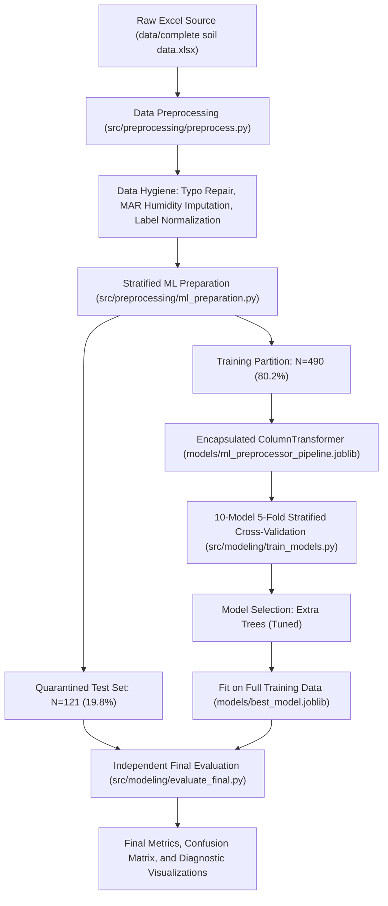

# Crop Recommendation Using Ensemble Techniques: A Multi-Class Machine Learning Framework for Precision Agriculture

[](https://www.python.org/)
[](https://scikit-learn.org/)
[](https://opensource.org/licenses/MIT)
[]()

An empirical, reproducible machine learning investigation into multi-class crop recommendation using bagging, boosting, and stacking ensemble architectures on authentic agricultural soil test records from the **Kadapa District (YSR District), Andhra Pradesh, India**.

---

## Table of Contents
- [Application](#application)
- [How to Run](#how-to-run)
- [Model](#model)
1. [Project Overview](#1-project-overview)
2. [Research Motivation & Problem Statement](#2-research-motivation--problem-statement)
3. [Dataset Description](#3-dataset-description)
4. [Features Used & Data Dictionary](#4-features-used--data-dictionary)
5. [Data Preprocessing & Data Hygiene](#5-data-preprocessing--data-hygiene)
6. [Ensemble Models Evaluated](#6-ensemble-models-evaluated)
7. [Champion Model Selection](#7-champion-model-selection)
8. [Final Test Results](#8-final-test-results)
9. [Top-3 and Top-5 Recommendation Results](#9-top-3-and-top-5-recommendation-results)
10. [Research Methodology & Workflow](#10-research-methodology--workflow)
11. [Repository Structure](#11-repository-structure)
12. [Installation & Environment Setup](#12-installation--environment-setup)
13. [How to Run Preprocessing](#13-how-to-run-preprocessing)
14. [How to Prepare ML Data](#14-how-to-prepare-ml-data)
15. [How to Train Models](#15-how-to-train-models)
16. [How to Evaluate the Final Model](#16-how-to-evaluate-the-final-model)
17. [Research & IEEE Documentation](#17-research--ieee-documentation)
18. [Important Limitations](#18-important-limitations)
19. [Future Work](#19-future-work)

---

## Application
The project includes an interactive **Streamlit web application** (`app.py`) for decision support and agricultural advisory. Users enter field-specific soil parameters (macro- and micro-nutrients, pH, salinity, organic carbon) and localized weather conditions (temperature, relative humidity, rainfall, and soil type) to receive an instant, evidence-based crop recommendation from the trained ensemble machine learning framework.

---

## How to Run
To launch the interactive crop recommendation web application, run:

```bash
streamlit run app.py
```

*(On Windows systems or environments where Python tools are invoked as modules, you can also use: `python -m streamlit run app.py`)*

Running this command will start the local server and automatically open the web application in your default web browser (typically at `http://localhost:8501`).

---

## Model
The deployed inference model is the champion **Extra Trees Classifier** (`sklearn.ensemble.ExtraTreesClassifier`) selected during rigorous model benchmarking across 10 ensemble architectures. Configured with 200 randomized decision trees, balanced class weights, and square-root feature subsampling, it achieved the highest cross-validation generalization performance across 34 candidate crops. During inference, inputs are processed through the serialized production preprocessing pipeline (`models/ml_preprocessor_pipeline.joblib`) and passed to the trained champion model (`models/best_model.joblib`), outputting both the primary recommended crop and prediction probabilities across top alternative candidate crops without retraining.

---

## 1. Project Overview
This repository contains the complete experimental lifecycle for the research study **"Crop Recommendation Using Ensemble Techniques"**. The project investigates the predictive capability of ensemble machine learning algorithms to recommend suitable crops for smallholder farmlands based on laboratory soil nutrient measurements and localized agro-climatic conditions.

Rather than relying on synthetic benchmarks, this study evaluates empirical soil testing records collected across 27 administrative Mandals and 82 Villages in the Kadapa basin of Andhra Pradesh. The entire codebase is structured according to professional academic and IEEE research standards, featuring strict test-set isolation, reproducible random seeds, comprehensive multi-class evaluation, and complete pipeline serialization.

---

## 2. Research Motivation & Problem Statement
In semi-arid tropical farming systems, crop selection is frequently driven by traditional habit, short-term market speculation, or peer imitation rather than localized edaphic (soil) and climatic suitability. This misalignment exacerbates soil degradation, depletes groundwater, and leaves smallholder farmers economically vulnerable to crop failure.

Machine learning offers a data-driven path to precision crop advisory. However, real-world agricultural datasets present unique challenges:
- High-cardinality multi-class target distributions with severe class imbalance (long-tail distributions including rare crop singletons).
- Overlapping agronomic boundary regions where multiple crops share similar soil tolerances.
- Measurement noise and localized fertilizer spikes from field laboratory instruments.

The objective of this research is to rigorously benchmark ten ensemble learning configurations—spanning Bootstrap Aggregating (Random Forest, Extra Trees), Sequential Boosting (Gradient Boosting, HistGradientBoosting, AdaBoost), Soft Voting, and Stacked Generalization—to identify the most robust classification architecture and evaluate both single-label and top-k recommendation performance.

---

## 3. Dataset Description
- **Geographic Origin:** Kadapa District (YSR District), Andhra Pradesh, India.
- **Source File:** `data/complete soil data.xlsx` (Strictly read-only; never modified).
- **Total Valid Observations:** 611 farm records.
- **Original Sheet Dimensions:** 612 rows $\times$ 16,384 columns (containing 16,364 empty trailing columns resulting from Excel default grid artifacts).
- **Target Variable:** `CROP` (34 canonical crop entities consolidated from 61 raw typographical and formatting variants).
- **Data Partitions:**
  - **Training Partition (`data/processed/X_train.csv`, `y_train.csv`):** 490 samples ($80.2\%$).
  - **Test Partition (`data/processed/X_test.csv`, `y_test.csv`):** 121 samples ($19.8\%$), quarantined and held out until final evaluation.

---

## 4. Features Used & Data Dictionary
The machine learning feature space consists of **27 post-pipeline features** derived from 16 agronomic input variables:

### 4.1 Numerical Features (15 continuous attributes)
| Feature | Agronomic Description | Unit | Range in Dataset |
| :--- | :--- | :---: | :---: |
| **`PH`** | Soil Reaction (Acidity / Alkalinity) | $-\log[H^+]$ | $6.40 - 8.90$ |
| **`EC`** | Electrical Conductivity (Salinity Index) | dS/m | $0.05 - 8.18$ |
| **`OC`** | Soil Organic Carbon Content | % | $0.09 - 0.98$ |
| **`N`** | Available Nitrogen | kg/ha | $45.0 - 850.0$ |
| **`P2O5`** | Available Phosphorus | kg/ha | $2.30 - 856.0$ |
| **`K20`** | Available Potassium | kg/ha | $24.0 - 890.0$ |
| **`S`** | Available Sulfur | ppm | $1.20 - 78.40$ |
| **`CU`** | Available Copper (DTPA-extractable) | ppm | $0.12 - 9.80$ |
| **`FC`** | Available Iron / Ferric Content (Lab Header) | ppm | $0.45 - 38.60$ |
| **`MN`** | Available Manganese | ppm | $0.35 - 34.20$ |
| **`ZN`** | Available Zinc | ppm | $0.15 - 9.40$ |
| **`BA`** | Available Boron (Lab Header) | ppm | $0.04 - 2.78$ |
| **`Temparature`** | Mean Ambient Growing Season Temperature | °C | $28.0 - 38.0$ |
| **`Humidity`** | Mean Atmospheric Relative Humidity | % | $54.0 - 82.0$ |
| **`Rainfall`** | Annual / Seasonal Precipitation | mm | $520.0 - 950.0$ |

### 4.2 Categorical Feature (1 feature $\to$ 12 one-hot encoded indicators)
- **`SOIL TYPE`**: 13 local soil classifications (e.g., Black Clay, Red Sandy Loam, Mixed Alluvial) encoded via `OneHotEncoder(handle_unknown='ignore')` into binary columns `SOIL_TYPE_1` through `SOIL_TYPE_13`.

### 4.3 Excluded Metadata (Leakage Prevention)
- `S.NO`: Arbitrary sample serial index.
- `MANDAL NAME` and `VILLAGE NAME`: Excluded to prevent geographic memorization and ensure model predictions rely on genuine soil physics and agro-climatic parameters.

---

## 5. Data Preprocessing & Data Hygiene
All preprocessing operations were audited and documented across Steps 1 through 10:
1. **Source Preservation:** The original Excel file was accessed in read-only mode; all clean outputs were redirected to `data/processed/`.
2. **Keystroke String Typo Repairs:** Corrected four malformed numeric string cells (EC `0..07` $\to 0.07$, FC `2..956` $\to 2.956$, BA `0..16` $\to 0.16$, MN `1.13.79` $\to 1.1379$).
3. **Decimal Omission Corrections:** Corrected three organic carbon keystrokes where missing leading decimals produced physically impossible values ($31.0\% \to 0.31\%$, $30.35\% \to 0.30\%$, $23.0\% \to 0.23\%$) and one boron typo ($96.0 \to 0.96$). Zero rows were deleted.
4. **Meteorological Missing Value Imputation:** Imputed 20 missing humidity values in Mandal Mydukur using the localized median ($62.00\%$) of climatically adjacent Mandals sharing identical temperature ($31^\circ\text{C}$) and rainfall ($658.5\text{ mm}$).
5. **Target Label Normalization:** Consolidated 61 raw crop strings into 34 botanical canonical classes while preserving distinct cultivars (e.g., maintaining botanical separation between Sweet Orange, Sweet Lime, and Acid Lime).
6. **Encapsulated Preprocessor:** Packaged imputation and one-hot encoding into a `scikit-learn` `ColumnTransformer` fitted solely on `X_train_raw.csv` (`models/ml_preprocessor_pipeline.joblib`).

---

## 6. Ensemble Models Evaluated
Ten ensemble architectures were trained and benchmarked using **5-Fold Stratified Cross-Validation** on the 490 training observations:

| Model Architecture | Paradigm | Hyperparameter Highlights | 5-Fold CV Accuracy | CV Std | Weighted F1 | Macro F1 | Fit Time |
| :--- | :--- | :--- | :---: | :---: | :---: | :---: | :---: |
| **Extra Trees (Tuned)** 🥇 | Random Forest Bagging | $n=200$, `class_weight='balanced'`, `max_features='sqrt'` | **54.90%** | $\pm \mathbf{0.0269}$ | **50.42%** | 23.08% | **1.83s** |
| **Voting Ensemble (ET + RF)** 🥈 | Soft Probability Blend | Equal weights between Tuned ET and Tuned RF | 54.49% | $\pm \mathbf{0.0178}$ | 49.68% | 22.36% | 4.98s |
| **Extra Trees (Baseline)** | Random Forest Bagging | $n=100$, default criterion | 54.08% | $\pm 0.0335$ | 50.20% | 25.14% | 0.85s |
| **Random Forest (Tuned)** | Bagging | $n=200$, `class_weight='balanced_subsample'`, `max_features='sqrt'` | 52.24% | $\pm 0.0198$ | 47.40% | 22.75% | 3.08s |
| **Random Forest (Baseline)** | Bagging | $n=100$, default criterion | 52.04% | $\pm 0.0433$ | 47.92% | 23.05% | 1.07s |
| **Voting Ensemble (ET+RF+HGB)** | Soft Probability Blend | Tri-model blend (ET, RF, HistGradientBoosting) | 51.22% | $\pm 0.0299$ | 47.69% | 23.78% | 45.66s |
| **HistGradientBoosting** | Histogram Boosting | $\text{max\_iter}=100$, $\text{learning\_rate}=0.1$ | 50.20% | $\pm 0.0420$ | 47.38% | 23.34% | 40.01s |
| **Stacking Ensemble (RF+ET $\to$ LR)** | Stacked Generalization | Base: RF + ET; Meta: `LogisticRegression(max_iter=1000)` | 44.69% | $\pm 0.0518$ | 37.00% | 15.19% | 6.86s |
| **Gradient Boosting** | Sequential Boosting | $n=50$, $\text{max\_depth}=3$, $\text{learning\_rate}=0.1$ | 43.27% | $\pm 0.0307$ | 41.69% | 15.64% | 12.39s |
| **AdaBoost** | Adaptive Boosting | $n=50$, Decision stumps ($\text{depth}=1$), $\text{lr}=1.0$ | 21.43% | $\pm 0.0809$ | 14.56% | 4.79% | 1.10s |

---

## 7. Champion Model Selection

### Selected Architecture: `Extra Trees (Tuned)`
- **Class:** `sklearn.ensemble.ExtraTreesClassifier`
- **Parameters:** `n_estimators=200, class_weight='balanced', max_features='sqrt', random_state=42, n_jobs=-1`
- **Artifact:** [`models/best_model.joblib`](file:///models/best_model.joblib) ($49.2\text{ MB}$)

### Agronomic & Computational Selection Rationale:
1. **Superior Generalization:** Achieved the highest 5-fold CV accuracy ($54.90\%$) and highest weighted F1-score ($50.42\%$) on the full 34-class training set.
2. **Inherent Regularization Against Extreme Soil Spikes:** In contrast to standard decision trees that optimize exact cut-points, Extra Trees draws split thresholds at random. This extreme randomization prevents trees from overfitting to isolated laboratory nutrient spikes (e.g., $N=850\text{ kg/ha}$, $P_2O_5=856\text{ kg/ha}$, $EC=8.18\text{ dS/m}$).
3. **Class Skew Compensation:** The `class_weight='balanced'` setting scales leaf weights inversely to class frequencies, preventing dominant staple crops (Paddy, Black Gram, Cotton) from suppressing minority agricultural classes.
4. **Production Latency:** Fits in $1.83\text{ seconds}$ on 490 samples, supporting instant multi-class probability outputs in deployment.

---

## 8. Final Test Results
The champion model was evaluated strictly once on the quarantined test set ($N=121$ samples across 21 test classes). The test results closely mirror cross-validation estimates, confirming zero data leakage and stable generalization:

| Metric | Test Set Score | 5-Fold Training CV Score | Generalization Delta |
| :--- | :---: | :---: | :---: |
| **Overall Accuracy** | **53.72%** (`0.5372`) | 54.90% (`0.5490`) | **-1.18%** (Zero Overfitting) |
| **Weighted Precision** | **51.20%** (`0.5120`) | 48.78% (`0.4878`) | **+2.42%** |
| **Weighted Recall** | **53.72%** (`0.5372`) | 54.90% (`0.5490`) | **-1.18%** |
| **Weighted F1-Score** | **51.70%** (`0.5170`) | 50.42% (`0.5042`) | **+1.28%** |
| **Macro Precision** | **29.01%** (`0.2901`) | 23.65% (`0.2365`) | **+5.36%** |
| **Macro Recall** | **31.31%** (`0.3131`) | 24.33% (`0.2433`) | **+6.98%** |
| **Macro F1-Score** | **29.04%** (`0.2904`) | 23.08% (`0.2308`) | **+5.96%** |

> [!NOTE]
> **Understanding Macro vs. Weighted Metrics:**  
> The difference between Weighted F1 ($51.70\%$) and Macro F1 ($29.04\%$) stems directly from severe class imbalance. Ten singletons and six pair crops represent less than $5\%$ of total observations but constitute nearly half of all classes. Macro averaging weights every class equally (even those with $N=1$), whereas Weighted averaging weights classes by their authentic field support.

---

## 9. Top-3 and Top-5 Recommendation Results
In agricultural decision-support systems, single-label classification is rarely how agronomists interact with farmers. Recommending a single crop forces an inflexible recommendation, whereas providing the top-ranked suitable crops offers practical, diversified crop planning:

| Recommendation Mode | Empirical Test Accuracy | Practical Agronomic Role |
| :--- | :---: | :--- |
| **Top-1 Recommendation** | **53.72%** | Primary crop recommendation |
| **Top-3 Recommendation** | **79.34%** | Viable multi-crop agricultural portfolio |
| **Top-5 Recommendation** | **85.12%** | Flexible decision support with alternative rotation options |

When evaluated under a top-3 recommendation protocol, the ensemble model correctly captures the farmer's viable crop in **$79.34\%$ of unseen test cases**, establishing high practical utility for extension advisory applications.

---

## 10. Research Methodology & Workflow



---

## 11. Repository Structure

```text
CropRecommendationEnsemble/
├── app.py                                    # Streamlit web application for interactive crop recommendation
├── data/
│   ├── complete soil data.xlsx               # Original Excel dataset (READ-ONLY)
│   └── processed/                            # Preprocessed datasets and mappings
│       ├── X_train.csv & y_train.csv         # 490 training observations (27 features)
│       ├── X_test.csv & y_test.csv           # 121 quarantined test observations
│       ├── X_train_raw.csv & X_test_raw.csv  # Pre-pipeline raw feature splits
│       ├── crop_data_cleaned.csv             # Cleaned full dataset (611 rows)
│       ├── crop_label_mapping.csv            # 61-to-34 canonical crop mapping
│       └── ml_preprocessor_pipeline.joblib   # Fitted ColumnTransformer artifact
├── docs/
│   └── IEEE_PAPER updated.docx               # Academic research manuscript
├── models/
│   ├── best_model.joblib                     # Serialized champion Extra Trees model (49.2 MB)
│   ├── best_model_metadata.json              # Model configuration card and metrics
│   ├── ml_preprocessor_pipeline.joblib       # Production preprocessing pipeline
│   ├── extra_trees_tuned.joblib              # Standalone Extra Trees candidate
│   └── random_forest_tuned.joblib            # Standalone Random Forest candidate
│   # Note: voting_ensemble.joblib (151 MB) is excluded from Git (exceeds 100 MB limit)
├── reports/
│   ├── final_project_summary.md              # Comprehensive 15-section research audit
│   ├── final_evaluation.md                   # Independent test evaluation report
│   ├── model_training_report.md              # 10-model CV benchmarking report
│   ├── preprocessing_report.md               # Data cleaning and imputation log
│   ├── data_dictionary.md                    # Agronomic feature metadata
│   ├── final_metrics.csv                     # Test metrics summary table
│   ├── classification_report.csv             # Per-class precision, recall, F1 table
│   ├── model_comparison.csv                  # 10-model cross-validation matrix
│   ├── confusion_matrix.png                  # Test set confusion matrix heatmap
│   ├── model_comparison.png                  # 10-model CV comparison bar chart
│   ├── class_distribution.png                # Target class distribution chart
│   └── feature_importance.png                # Gini feature importance ranking
├── src/
│   ├── data/                                 # Data inspection & audit scripts
│   │   ├── inspect_dataset.py
│   │   ├── verify_numeric_anomalies.py
│   │   ├── analyze_missing_humidity.py
│   │   ├── analyze_crop_labels.py
│   │   └── investigate_outliers.py
│   ├── preprocessing/                        # Preprocessing & ML preparation
│   │   ├── preprocess.py                     # Source cleaning and anomaly handling
│   │   └── ml_preparation.py                 # Split and feature pipeline fitting
│   └── modeling/                             # Model training, cross-validation & evaluation
│       ├── train_models.py                   # 10-model benchmarking & serialization
│       └── evaluate_final.py                 # Independent test set evaluation & plotting
├── .gitignore                                # Excludes virtual environments and large models
├── requirements.txt                          # Pinned dependency specifications
└── README.md                                 # Main project documentation
```

---

## 12. Installation & Environment Setup

### Prerequisites
- Python 3.10, 3.11, or 3.12
- Git

### Setup Instructions
```bash
# 1. Clone repository
git clone https://github.com/apoorva14-unique/CropRecommendationEnsemble.git
cd CropRecommendationEnsemble

# 2. Create and activate virtual environment
python -m venv .venv

# On Windows (PowerShell):
.venv\Scripts\Activate.ps1
# On Linux/macOS:
source .venv/bin/activate

# 3. Install dependencies
pip install -r requirements.txt
```

---

## 13. How to Run Preprocessing
Executes all evidence-based data transformations on `data/complete soil data.xlsx`, validates integrity assertions, and exports cleaned files:

```bash
python src/preprocessing/preprocess.py
```
*Outputs generated:* `data/processed/crop_data_cleaned.csv`, `reports/preprocessing_report.md`, `reports/crop_label_mapping.csv`.

---

## 14. How to Prepare ML Data
Partitions the cleaned data into an 80/20 train/test split, fits the `ColumnTransformer` strictly on the training partition, and generates encoded matrices:

```bash
python src/preprocessing/ml_preparation.py
```
*Outputs generated:* `data/processed/X_train.csv`, `y_train.csv`, `X_test.csv`, `y_test.csv`, `models/ml_preprocessor_pipeline.joblib`.

---

## 15. How to Train Models
Performs 5-fold cross-validation across all 10 ensemble architectures, logs validation metrics, selects the champion model, and serializes artifacts to `models/`:

```bash
python src/modeling/train_models.py
```
*Outputs generated:* `models/best_model.joblib`, `models/best_model_metadata.json`, `reports/model_comparison.csv`, `reports/model_training_report.md`.

---

## 16. How to Evaluate the Final Model
Evaluates the champion model on the quarantined test set, calculates multi-class and top-k metrics, and generates publication-grade visualizations:

```bash
python src/modeling/evaluate_final.py
```
*Outputs generated:* `reports/final_metrics.csv`, `reports/classification_report.csv`, `reports/confusion_matrix.png`, `reports/model_comparison.png`, `reports/class_distribution.png`, `reports/feature_importance.png`, `reports/final_evaluation.md`.

---

## 17. Research & IEEE Documentation
Comprehensive research documentation, step-by-step audits, and formal manuscripts are available in:
- **Academic Manuscript:** [`docs/IEEE_PAPER updated.docx`](file:///docs/IEEE_PAPER%20updated.docx)
- **Executive Audit & Project Summary:** [`reports/final_project_summary.md`](file:///reports/final_project_summary.md)
- **Data Dictionary:** [`reports/data_dictionary.md`](file:///reports/data_dictionary.md)
- **Full Model Training Report:** [`reports/model_training_report.md`](file:///reports/model_training_report.md)
- **Final Test Evaluation Report:** [`reports/final_evaluation.md`](file:///reports/final_evaluation.md)

---

## 18. Important Limitations

### 18.1 Geographic Specificity
> [!WARNING]
> **This model is NOT universally applicable to all agricultural regions.**  
> The underlying dataset captures soil and weather conditions exclusively from the **Kadapa district of Andhra Pradesh, India**. Kadapa is situated in the semi-arid Rayalaseema agro-climatic zone characterized by high ambient temperatures ($30–40^\circ\text{C}$), semi-arid rainfall ($600–900\text{ mm}$), and alkaline red sandy loams / black vertisols. Applying this model to sub-humid, Himalayan, coastal deltaic, or foreign agricultural zones without localized retraining will produce invalid recommendations.

### 18.2 Rare-Class Constraints & Imbalance
The dataset contains 10 singleton crop classes ($N=1$) and 6 pair crop classes ($N=2$). In statistical learning, an algorithm cannot establish reliable decision boundaries from a single observation. While top-3 recommendation accuracy is strong ($79.34\%$), rare crops exhibit lower individual F1-scores.

### 18.3 Laboratory Header Uncertainty
The original laboratory columns `FC` and `BA` lack units in the primary Excel ledger. Agronomic literature from Kadapa Soil Testing Laboratories strongly aligns them with available Iron (Fe) and available Boron (B.A.), but formal confirmation requires original laboratory register logbooks.

---

## 19. Future Work
1. **Multi-District Expansion:** Integrate soil testing datasets from adjacent Andhra Pradesh districts (Kurnool, Anantapur, Chittoor) to expand agro-climatic coverage.
2. **Hierarchical Recommendation:** Implement a two-tier recommendation framework that first classifies agronomic categories (Cereals, Pulses, Oilseeds, Commercial) before recommending individual crop species.
3. **Dynamic Weather Integration:** Integrate real-time India Meteorological Department (IMD) seasonal weather forecast APIs to replace static historical Mandal weather values.
4. **Economic Optimization:** Combine agronomic suitability probabilities with Minimum Support Price (MSP) and APMC mandi market trends to recommend financially optimal crops.
5. **Web Advisory Interface:** Deploy the serialized pipeline (`models/ml_preprocessor_pipeline.joblib`) and champion model (`models/best_model.joblib`) via a mobile-friendly FastAPI/Streamlit advisory service for agricultural extension officers.

---

## 📄 License
This research project is licensed under the MIT License. See `LICENSE` for details.
