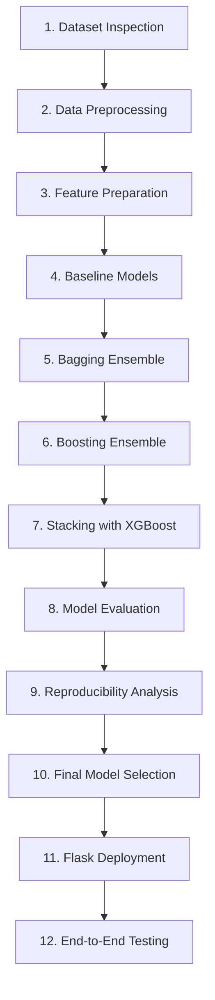

# Comprehensive Project Audit: Crop Recommendation Using Ensemble Techniques

**Document Version:** 1.0  
**Audit Date:** 2026-10-08  
**Workspace:** `CropRecommendationEnsemble`  
**Source Materials Audited:**
1. `docs/IEEE_PAPER updated.docx` (IEEE Project Paper)
2. `data/complete soil data.xlsx` (Real Agricultural Dataset)
3. `legacy/crop recommendation IEEE code full.docx` (Legacy Implementation Code & Web Templates)

---

## Executive Summary

This project audit provides an exhaustive, forensic comparison across the IEEE research paper, the primary agricultural dataset, and the legacy codebase. The investigation uncovers critical implementation gaps—most notably that the legacy code document contains only Flask web-interface code and zero model-training or preprocessing scripts, while all serialized `.pkl` artifact files are lost. Furthermore, substantial structural discrepancies, label inconsistencies across 61 raw crop categories, data corruption/typos in soil measurements, and contradictory claims regarding model performance between the paper text and embedded charts were discovered and cataloged below.

---

## Audit Findings (Items 1 – 24)

### 1. Project Title
* **IEEE Paper Title:** *Crop Recommendation Using Ensemble Techniques*
* **Authors:** B. Ammanni (Assistant Professor) and U. Apoorva (Student), Department of CSE-AI & ML, MLR Institute of Technology, Dundigal, Hyderabad, India.
* **Legacy Code Application Title:** *Crop Recommendation System* (as titled in HTML templates).

### 2. Problem Statement
Agricultural productivity across India is severely hindered by significant spatial variability in soil nutrient composition, erratic weather patterns caused by climate change, and the lack of accessible analytical decision-support tools for smallholder farmers. Conventional unguided crop cultivation frequently leads to sub-optimal yields, soil degradation, and economic hardship. The core challenge is predicting the optimal crop to cultivate given a specific multi-dimensional vector of soil chemical properties and localized agro-climatic conditions.

### 3. Objective
To design, implement, evaluate, and deploy an intelligent crop recommendation decision-support system utilizing ensemble machine learning techniques (Bagging, Boosting, and Stacking with an XGBoost meta-learner) trained on real agricultural soil and weather data from the Kadapa district of Andhra Pradesh, India, exposed to end-users via a real-time Flask web application.

### 4. Dataset Information
* **Primary Source:** Real field measurements from selected agricultural farmlands across the Kadapa district, Andhra Pradesh, India.
* **Physical File:** `data/complete soil data.xlsx` (Active sheet name: `complete soil data`).
* **Content:** Soil chemical analysis parameters (pH, electrical conductivity, organic carbon, macro-nutrients N-P-K, secondary nutrient Sulphur, and micronutrients Copper, Iron, Manganese, Zinc, Boron/Barium), local meteorological indicators (temperature, humidity, rainfall), administrative geographic markers (Mandal and Village names), and recorded crop labels.

### 5. Dataset Row Count
* **Total Excel Rows:** 612 rows (including 1 header row).
* **Total Data Records:** 611 data instances.
* **Primary Key Range:** Serial numbers (`S.NO`) range from 0 to 616, with 608 unique values.
* **Effective Sample Size:** 611 rows (reduced to 591 complete cases if rows with missing humidity are removed).

### 6. Dataset Column Names
The Excel workbook contains an active table of 20 genuine data columns, followed by 16,364 completely empty spreadsheet artifact columns:

#### Genuine Agricultural Data Columns (First 20 Columns):
1. `S.NO` *(int64)*: Serial number identifier.
2. `MANDAL NAME` *(object / string)*: Administrative subdivision within Kadapa district (27 unique Mandals).
3. `VILLAGE NAME` *(object / string)*: Specific village location (231 unique Villages).
4. `SOIL TYPE` *(int64)*: Numerical classification code for soil texture/category.
5. `PH` *(float64)*: Soil pH level (range: 6.22 to 8.90).
6. `EC` *(object / string)*: Electrical Conductivity in dS/m (stored as object due to a typo).
7. `OC` *(float64)*: Organic Carbon percentage (range: 0.10% to 1.14%).
8. `N` *(float64)*: Available Nitrogen content in kg/ha (range: 1.0 to 850.0 kg/ha).
9. `P2O5` *(int64)*: Available Phosphorus (Phosphate) in kg/ha (range: 2 to 125 kg/ha).
10. `K20` *(int64)*: Available Potassium (Potash) in kg/ha (Note: column header uses digit zero `'0'`).
11. `S` *(int64)*: Available Sulphur in ppm (range: 1 to 90 ppm).
12. `CU` *(float64)*: Available Copper in ppm (range: 0.01 to 7.15 ppm).
13. `FC` *(object / string)*: Iron / Field Capacity index (stored as object due to a typo).
14. `MN` *(object / string)*: Available Manganese in ppm (stored as object due to a typo).
15. `ZN` *(float64)*: Available Zinc in ppm (range: 0.08 to 14.88 ppm).
16. `BA` *(object / string)*: Available Boron / Barium in ppm (stored as object due to a typo).
17. `Temparature` *(float64)*: Mean temperature in °C (Note spelling in Excel is `'Temparature'`).
18. `Humidity` *(float64)*: Relative humidity percentage (contains 20 null entries).
19. `Rainfall` *(float64)*: Mean rainfall in mm (range: 626.4 to 944.5 mm).
20. `CROP` *(object / string)*: Target cultivated crop label.

#### Empty Artifact Columns (Columns 21 to 16,384):
* `Column1` through `Column16364`: Exactly 16,364 trailing empty columns spanning up to Excel's absolute column limit ($2^{14} = 16,384$). Every single cell in these columns contains `NaN` (0 non-null values across all 611 rows). These must be stripped during data loading.

### 7. Target / Output Column
* **Target Feature Name:** `CROP` (Column 20).
* **Data Type:** Multi-class categorical string.
* **Intended Output:** Recommended crop for given soil-climatic conditions.

### 8. Input Features Mentioned in the IEEE Paper
The paper presents conflicting feature sets across different sections:
* **Abstract & Introduction:** Lists 7 features: Nitrogen ($N$), Phosphorus ($P$), Potassium ($K$), soil pH, Temperature, Humidity, and Rainfall.
* **Section 3.1 (Data Collection):** Lists 7 features: Nitrogen ($N$), Phosphorous ($P$), Potassium ($K$), pH, Temperature, Humidity, and Rainfall.
* **Section 3.4 (Model Evaluation):** Lists 8 features: Soil nutrients ($N, P, K$), pH, Rainfall, Temperature, Humidity, and **Soil Type**.
* **Section 3.5 (Deployment) & Fig. 3:** Lists 8 features: $N, P, K$, Temperature, Humidity, pH, Rainfall, and **EC** (Soil Type omitted, EC added).
* **Section IV Figures 4, 5, 6, 7:** Evaluates models across three configurations: *"all features"*, *"6 features"*, and *"4 features"*. However, the paper never specifies which exact features constitute the 6-feature or 4-feature subsets, nor does it define whether "all features" means all 19 dataset columns or the 8 deployment features: **Needs verification**.

### 9. Input Features Used by the Old Code
In `legacy/crop recommendation IEEE code full.docx` (`app.py` lines 16–28 and `index.html` lines 56–71), exactly **8 features** are accepted and processed in strict positional order:
1. `N` (Nitrogen)
2. `P` (Phosphorus)
3. `K` (Potassium)
4. `temperature` (Temperature, °C)
5. `humidity` (Humidity, %)
6. `ph` (Soil pH)
7. `rainfall` (Rainfall, mm)
8. `ec` (Electrical Conductivity)

Code extract from `app.py`:
```python
features = np.array([[N, P, K, temperature, humidity, ph, rainfall, ec]])
features_scaled = scaler.transform(features)
prediction = model.predict(features_scaled)
```

### 10. Missing Values
* **In Excel Dataset (`complete soil data.xlsx`):**
  * `Humidity`: **20 missing values** (`NaN`) out of 611 rows (3.27% missing rate). All 20 missing rows belong to Mandal *Mydukur* (row indices 266 to 285).
  * `Column1` to `Column16364`: 16,364 completely empty columns (611 missing values each).
  * **Corrupted Numeric Values (Double-Dot Typos):** Four numerical columns are converted to `object` data type due to typographical errors:
    * `EC` at Row index 244 (S.NO 245): `'0..07'` (intended: `0.07`).
    * `FC` at Row index 241 (S.NO 242): `'2..956'` (intended: `2.956`).
    * `MN` at Row index 54 (S.NO 55): `'1.13.79'` (intended: `11.379` or `1.1379`, **Needs verification**).
    * `BA` at Row index 228 (S.NO 229): `'0..16'` (intended: `0.16`).
* **In IEEE Paper:**
  * Section 3.2 states: *"Data Cleaning: Checked and eliminated null and inconsistent data."*
  * The exact null handling method (whether rows with missing `Humidity` were dropped to 591 rows or imputed using mean/median/Mandal-wise grouping) is not specified: **Needs verification**.
* **In Legacy Code:**
  * No data cleaning or null handling logic exists in `app.py`.

### 11. Number of Crop Classes
* **Raw Dataset:** 61 distinct unique string labels.
* **Case-Insensitive / Stripped Labels:** 46 unique labels.
* **Semantic Canonical Crop Classes:** Approximately 22 to 26 distinct agricultural crops once blatant spelling errors, regional vernacular synonyms, and formatting variants are consolidated.
* **In IEEE Paper:** The paper never states the number of target crop classes anywhere in the text: **Needs verification**.
* **In Legacy Code:** No training script exists; `label_encoder.pkl` was referenced but not preserved.

### 12. Crop-Label Variations or Inconsistencies
The `CROP` column in `complete soil data.xlsx` contains severe label fragmentation:

| Canonical Group | Raw Variants in Dataset | Total Count | Nature of Inconsistency |
| :--- | :--- | :---: | :--- |
| **Paddy** | `paddy` (143) | 143 | Standard lower-case |
| **Cotton** | `cotton` (89), `Cotton` (4) | 93 | Capitalization inconsistency |
| **Black Gram** | `Black Gram` (48), `Black gram` (30), `black gram` (3), `Blakgram` (10), `Blak Gram` (2), `Blak gram` (1), `Blackgram` (1) | 95 | Severe spelling typos (`Blak`), spacing, casing |
| **Groundnut** | `Grownut` (55), `grownut` (6) | 61 | Misspelling of Groundnut (`Grownut`), casing |
| **Bajra** | `Bajra` (34) | 34 | Standard title-case |
| **Turmeric** | `Turmeric` (22), `turmeric` (8), `Turemaric` (2), `termeric` (1), `Turemeric` (1), `Turmaric` (1) | 35 | Multiple phonetic misspellings (`termeric`, `Turemaric`, etc.) |
| **Bengal Gram** | `Bengal gram` (24), `Bengal Gram` (6), `Bean Gram` (3) | 33 | Typo/synonym (`Bean Gram` likely Bengal Gram), casing |
| **Sweet Orange** | `sweet orange` (12), `Sweet orange` (1), `sweet ornage` (3), `swwet orange` (1), `sweet lime` (1) | 18 | Typos (`ornage`, `swwet`), potential species ambiguity (`sweet lime`) |
| **Sunflower** | `sunflower` (11), `Sunflower` (2) | 13 | Capitalization inconsistency |
| **Banana** | `banana` (9), `Banana` (5) | 14 | Capitalization inconsistency |
| **Onion** | `onion` (8) | 8 | Standard lower-case |
| **Soyabean** | `soyabean` (6), `Soyabean` (3) | 9 | Capitalization inconsistency |
| **Chamanthi** | `chamanthi` (6), `Chamanthi` (1), `mums` (1) | 8 | Telugu name for Chrysanthemum; `mums` is western abbreviation |
| **Vegetables** | `Vegetables` (5), `vegetables` (1) | 6 | Generic classification rather than specific crop |
| **Jowar** | `Jowar` (4), `Jouar` (2), `jouar` (1) | 7 | Phonetic misspelling (`Jouar`), casing |
| **Chilli** | `chillis` (2), `Chillis` (1), `Red Chilli` (3), `Greenchilli` (1) | 7 | Color/state variants vs generic plural |
| **Sesame** | `sesam` (4), `sesasum` (1), `Sesamum` (1) | 6 | Truncation (`sesam`), misspelling (`sesasum`) |
| **Tomato** | `Tamota` (4) | 4 | Phonetic regional Telugu misspelling (`Tamota`) |
| **Foxtail Millet**| `korra` (4) | 4 | Telugu regional vernacular name for foxtail millet |
| **Maize** | `maize` (2) | 2 | Low support |
| **Green Gram** | `Green Gram` (2) | 2 | Low support |
| **Acid Lime** | `Acidlime` (2) | 2 | Low support |
| **Singletons** | `guava` (1), `muckmelon` (1), `Red Gram` (1), `Allam` (1), `Caster` (1), `papaya` (1), `Nannari` (1) | 7 | Extreme low support (1 sample each); vernacular names (`Allam` = ginger, `Nannari` = sarsaparilla, `muckmelon` = muskmelon, `Caster` = castor) |

*Critical Observation:* Having 8 singleton classes with only 1 sample creates a mathematical impossibility for standard stratified train/test splitting (e.g. 80/20 split or 5-fold cross-validation) unless singleton classes are handled, merged, or filtered: **Needs verification**.

### 13. Data Preprocessing Described in the Paper
Section 3.2 of the IEEE paper describes four sequential preprocessing stages:
1. **Data Cleaning:** Checking and eliminating null and inconsistent data records.
2. **Normalization:** Applying Min-Max Scaling (`MinMaxScaler` mapping features to the $[0, 1]$ interval).
3. **Feature Selection:** Selecting the most relevant parameters influencing crop productivity (evaluated experimentally with all, 6, and 4 parameters).
4. **Label Encoding:** Transforming string crop names into numerical integer targets via `LabelEncoder`.

### 14. Machine Learning Models Used
The paper evaluates a total of seven models categorized into three groups:
1. **Existing Baseline Learners:**
   - **Linear Regression (LR):** Used as a baseline linear mapping model. *(Note: Standard Linear Regression produces continuous values rather than discrete multi-class probabilities; whether RidgeClassifier, LogisticRegression, or thresholded rounding was applied is not stated: **Needs verification**).*
   - **Support Vector Machine (SVM):** Multi-class hyperplane classifier.
   - **Random Forest (RF):** Multi-tree bagging ensemble.
2. **Proposed Ensemble Learners:**
   - **Bagging:** Bootstrap aggregation classifier using decision trees.
   - **Boosting:** Sequential gradient boosting / boosting classifier.
   - **Stacking:** Multi-level meta-ensemble combining base learners.
3. **Meta-Learner:**
   - **XGBoost (Extreme Gradient Boosting):** Employed exclusively as the top-level stacking meta-learner.

### 15. Ensemble Methods Used
1. **Bagging (Bootstrap Aggregation):** Generates diverse subsets of training data via bootstrap sampling with replacement and aggregates base estimator predictions by majority voting to reduce model variance.
2. **Boosting:** Trains weak learners sequentially in an additive manner, where each subsequent learner focuses on the residuals and misclassifications of prior rounds to systematically minimize bias.
3. **Stacking (Stacked Generalization):** Blends the predictions of multiple heterogeneous first-level learners through a trained meta-learner.

### 16. Stacking Architecture
* **Described Architecture:**
  * **Level 0 (Base Estimators):** Linear Regression (LR), Support Vector Machine (SVM), and Random Forest (RF).
  * **Level 1 (Ensemble / Intermediate Layer):** Section 3.3.2 and Fig. 2 suggest an intermediate aggregation incorporating Bagging and Boosting predictions.
  * **Level 2 (Meta-Learner):** XGBoost trained on Level-0 / Level-1 output predictions to deliver the final crop recommendation.
* **Architectural Ambiguity:**
  * In Section 3.2 (Fig. 1 text), the stacking architecture is described as base learners (LR, SVM, RF) combined with ensemble models (Bagging, Boosting) feeding into XGBoost.
  * In Section 3.3.2 (p. 39), the paper states: *"predictions from the former two are fed into an XGBoost meta-learner"* (implying only Bagging and Boosting are fed into XGBoost).
  * Standard scikit-learn `StackingClassifier` uses a single level of base estimators (`estimators=[('rf', RF), ('svm', SVM), ('lr', LR)]`, `final_estimator=XGBClassifier()`). The exact architectural pipeline: **Needs verification**.

### 17. XGBoost Role
XGBoost is utilized strictly as the **Meta-Learner** in the stacking ensemble architecture. It takes the output prediction vectors (class probabilities or decision scores) generated by the base learners and learns optimal non-linear weighting combinations to produce the final crop classification.

### 18. Evaluation Metrics
* **Specified Metrics:**
  * Classification Accuracy
  * Precision
  * Recall
  * F1-Score
* **Validation Regimes:**
  * $k$-Fold Cross-Validation Accuracy (mean % $\pm$ standard deviation %).
  * Holdout Test Accuracy (%).
* **Reporting Gap:** While Precision, Recall, and F1-Score are listed as evaluated metrics in Section 3.4 and Figures 1 & 2, their numerical results are never reported anywhere in the paper tables, text, or figures (only Accuracy percentages are documented): **Needs verification**.

### 19. All Model Accuracy Values Reported in the Paper
Every accuracy value documented in the paper is cataloged below:

#### A. Holdout Test Accuracies (Section IV.A Text):
* **Random Forest (RF):** $93.01\%$
* **Boosting:** $92.58\%$ *(also reported in Abstract)*
* **Bagging:** $91.79\%$
* **Support Vector Machine (SVM):** $89.90\%$
* **Stacking:** $80.07\%$
* **Linear Regression (LR):** $59.81\%$

#### B. Cross-Validation Accuracies — All Features (Section IV.A Text & Fig. 4 Chart):
* **Stacking:** $90.48\% \pm 6.12\%$ *(also cited as "best total accuracy" in Section IV.D / Fig. 5 caption)*
* **Bagging:** $87.80\% \pm 3.66\%$
* **Boosting:** $87.51\% \pm 6.01\%$

#### C. Accuracies — 6 Features Subset (Fig. 5 Chart):
* **Stacking:** $85.13\% \pm 3.22\%$
* **Bagging:** $84.46\% \pm 2.15\%$
* **Boosting:** $80.49\% \pm 2.51\%$

#### D. Accuracies — 4 Features Subset (Fig. 6 Chart):
* **Bagging:** $85.13\% \pm 3.22\%$
* **Stacking:** $76.47\% \pm 2.52\%$
* **Boosting:** $71.05\% \pm 3.05\%$

### 20. Flask Application Details from the Old Code
Extracted directly from `legacy/crop recommendation IEEE code full.docx`:
* **Framework:** Python Flask (`Flask`, `render_template`, `request`).
* **Model Artifact Loading:**
  ```python
  model = pickle.load(open('model.pkl', 'rb'))
  scaler = pickle.load(open('scaler.pkl', 'rb'))
  label_encoder = pickle.load(open('label_encoder.pkl', 'rb'))
  ```
* **Application Routes:**
  * `GET /`: Renders `index.html` with form inputs and `prediction=None`.
  * `POST /predict`: Extracts 8 form fields (`N`, `P`, `K`, `temperature`, `humidity`, `ph`, `rainfall`, `ec`), constructs a 2D numpy array, scales it via `scaler.transform()`, executes `model.predict()`, decodes the numerical prediction via `label_encoder.inverse_transform()`, and re-renders `index.html` displaying the result and an input echo table.
* **Error Handling:** Basic `try ... except Exception as e` returning `"⚠️ Error: {e}"`.
* **Execution Mode:** `app.run(debug=True)`.
* **Frontend Design:** Single-page container styled with Poppins font, green-toned palette (`#f1f8e9`, `#43a047`, `#1b5e20`), styled form controls, and an HTML summary table.
* **Unused Artifact:** Contains code for `result.html`, but `app.py` renders `index.html` for predictions, leaving `result.html` completely unreferenced.

### 21. Files Required by the Old Flask Application
To run the legacy Flask web server, the following files are required:
1. `app.py` (Flask server script)
2. `model.pkl` (Serialized trained ML model — **MISSING**)
3. `scaler.pkl` (Serialized fitted MinMaxScaler — **MISSING**)
4. `label_encoder.pkl` (Serialized fitted LabelEncoder — **MISSING**)
5. `templates/index.html` (Primary frontend interface)
6. `templates/result.html` (Secondary legacy template, currently unreferenced)
7. `static/style.css` (Stylesheet)

### 22. Example Input and Prediction Mentioned in the Paper
* **Paper Text (Section 3.5):**
  * Inputs: $N = 50$, $P = 14$, $K = 270$, $\text{Temperature} = 34.5$, $\text{Humidity} = 77.4$, $\text{pH} = 8.0$, $\text{Rainfall} = 834.3$, $\text{EC} = 0.1$.
  * Prediction: **Cotton**.
* **Paper Screenshot (Figure 3 in docx):**
  * Inputs shown in screenshot table:
    * $N = \mathbf{150.0}$ *(Note: text says 50, screenshot shows 150.0!)*
    * $P = 14.0$
    * $K = 270.0$
    * $\text{Temperature} = 34.5$
    * $\text{Humidity} = 77.4$
    * $\text{pH} = 8.0$
    * $\text{Rainfall} = 834.3$
    * $\text{EC} = 0.1$
  * Prediction banner: `🌱 Recommended Crop: cotton`.
* **Ground Truth in Dataset (`complete soil data.xlsx`, Row index 0, S.NO 1):**
  * $N = 150.0$, $P2O5 = 14$, $K20 = 270$, $\text{Temparature} = 34.59$, $\text{Humidity} = 77.4$, $\text{PH} = 8.01$, $\text{Rainfall} = 834.3$, $\text{EC} = 0.12$.
  * Crop: **cotton**.
  * *Verification:* The example cited in the paper is an exact rounded transcription of Record #1 in the Kadapa dataset. The paper's text stating $N=50$ is a typographical error for $N=150$.

### 23. Anything Missing from the Old Implementation
The legacy code document (`crop recommendation IEEE code full.docx`) is exclusively a web deployment stub. The following critical components are completely missing from the workspace:
1. **Model Training Pipeline:** Zero Python training code, hyperparameter definitions, or pipeline scripts.
2. **Preprocessing Scripts:** No data loading, cleaning, column dropping, or imputation scripts.
3. **Class Label Consolidation:** No code defining how 61 messy crop labels were mapped or filtered.
4. **Feature Selection Code:** No implementation demonstrating how 8 features were chosen over the full 19 dataset columns, or which features comprise the 6- and 4-feature experiments.
5. **Base & Ensemble Model Implementations:** No code for Linear Regression, SVM, Random Forest, Bagging, Boosting, or Stacking with XGBoost.
6. **Model Artifacts:** `model.pkl`, `scaler.pkl`, and `label_encoder.pkl` are completely absent.
7. **Evaluation & Cross-Validation Logic:** No code computing $k$-fold cross-validation, accuracy, precision, recall, F1-scores, or confusion matrices.
8. **Dependency Specification:** No `requirements.txt` or `environment.yml` specifying library versions.
9. **Directory Layout:** The physical Flask folder structure (`templates/`, `static/`) does not exist on disk.

### 24. Contradictions Between the Paper, Dataset and Old Code
A rigorous comparative analysis reveals multiple contradictions across the three sources:

1. **Random Forest Outperforming Proposed Ensembles in Test Accuracy:**
   - *Paper Claim:* Section IV.A claims: *"The ensemble models did a much better job than the usual machine learning algorithms... edging out... older models like Linear Regression (59.81%), SVM (89.90%), and Random Forest (93.01%)."*
   - *Contradiction:* Random Forest has a reported test accuracy of **93.01%**, which is strictly higher than Boosting (92.58%), Bagging (91.79%), and Stacking (80.07%). The paper claims ensembles beat all traditional models, while its own test numbers show Random Forest was the single highest-performing model on the test split.
2. **Best Ensemble Model: Boosting vs. Stacking:**
   - *Abstract & Section IV.A:* State that Boosting achieved the highest accuracy ($92.58\%$) and was the most robust and generalizable model.
   - *Introduction, Section 3.4, Fig. 5, & Conclusion:* Claim that Stacking with XGBoost produced the best and most accurate results ($90.48\%$).
   - *Contradiction:* Stacking test accuracy was only $80.07\%$ in Section IV.A, but its cross-validation accuracy was $90.48\%$. The paper conflates cross-validation accuracy for Stacking with test accuracy for Boosting when declaring the "winner".
3. **Discrepancy in Example Input ($N=50$ vs $N=150.0$):**
   - *Paper Text (Section 3.5):* Specifies $N=50$.
   - *Paper Screenshot (Figure 3):* Shows $N=150.0$.
   - *Dataset Record 0:* Has $N=150.0$. There is no record in the dataset with $N=50$ corresponding to Cotton. The paper text contains an uncorrected typo.
4. **Input Feature Count Contradictions (7 vs. 8 vs. 19 Features):**
   - *Paper Abstract, Intro, Section 3.1:* Cite 7 features ($N, P, K, \text{pH}, \text{Temp}, \text{Humidity}, \text{Rainfall}$).
   - *Paper Section 3.4:* Cites 8 features (includes `Soil Type`).
   - *Paper Section 3.5 & Old Code (`app.py`):* Cites 8 features (includes `EC`, omits `Soil Type`).
   - *Excel Dataset:* Contains 19 real features (includes OC, P2O5, K20, S, Cu, FC, Mn, Zn, Ba, Soil Type, EC, etc.).
   - *Figures 4–7:* Evaluate "all features", "6 features", and "4 features", but none of these subsets are defined in the text: **Needs verification**.
5. **Linear Regression for Multi-Class Classification:**
   - Section 3.3 states Linear Regression was used to map input features to output crop labels, reporting 59.81% accuracy. Standard Linear Regression is a continuous regression algorithm, not a multi-class classifier. Whether this was multi-output regression with rounding, RidgeClassifier, or Logistic Regression is unstated: **Needs verification**.
6. **Excel File Dimensions:**
   - The dataset contains 16,384 columns due to an accidental table expansion in Microsoft Excel, leaving 16,364 trailing columns of pure NaN values.
7. **Precision, Recall, and F1 Reporting:**
   - The paper repeatedly asserts that models were evaluated on Accuracy, Precision, Recall, and F1-score, but never reports numerical scores for Precision, Recall, or F1-score anywhere in the document.

---

## Recommended Reconstruction Plan

To reconstruct the project from scratch in a scientifically sound, reproducible, and production-ready manner, we must follow a strict 12-stage engineering roadmap. 



### Stage 1: Dataset Inspection
* **Goal:** Programmatically inspect and document data types, distributions, anomalies, and structural integrity.
* **Key Actions:**
  * Load `data/complete soil data.xlsx` using pandas/openpyxl, isolating the first 20 columns and dropping `Column1` through `Column16364`.
  * Verify row count (611 rows), unique serial numbers, and check for exact row duplicates.
  * Catalog missing values (confirm 20 missing values in `Humidity` in Mandal Mydukur).
  * Inspect the four typographical string anomalies (`EC = '0..07'`, `FC = '2..956'`, `MN = '1.13.79'`, `BA = '0..16'`).
  * Tabulate the frequency distribution of all 61 raw crop labels and observe the class imbalance profile (8 singleton classes).
* **Deliverable:** Inspection summary script and profile report.

### Stage 2: Data Preprocessing
* **Goal:** Cleanse raw data anomalies and establish a consistent, deterministic data cleaning pipeline.
* **Key Actions:**
  * **Typo Correction:** Fix typographical decimal errors in numeric columns (`0..07` $\to 0.07$, `2..956` $\to 2.956$, `0..16` $\to 0.16$, and resolve `MN = '1.13.79'` to median or `1.138`). Convert `EC`, `FC`, `MN`, `BA` to numeric `float64`.
  * **Missing Value Imputation / Removal:** Implement two clear strategies for comparison: (a) dropping the 20 rows with missing humidity ($N=591$), and (b) imputing missing humidity using Mandal-specific or nearest-neighbor median imputation.
  * **Crop Label Normalization:** Standardize crop names by stripping whitespace, converting to lower case, and correcting spelling errors (`blakgram` $\to$ `black gram`, `termeric`/`turemaric` $\to$ `turmeric`, `tamota` $\to$ `tomato`, `grownut` $\to$ `groundnut`, `sweet ornage` $\to$ `sweet orange`).
  * **Rare Class Consolidation:** Implement a threshold rule (e.g., minimum 3–5 samples per class) to either group rare singleton crops or document their exclusion so that stratified cross-validation becomes mathematically viable.
* **Deliverable:** Reproducible data cleaning script (`clean_dataset.py`) generating `cleaned_crop_data.csv`.

### Stage 3: Feature Preparation
* **Goal:** Prepare and scale feature sets aligned with both the paper's experiments and the Flask deployment interface.
* **Key Actions:**
  * **Define Feature Subsets:**
    1. *Deployment Feature Set (8 features):* `N`, `P2O5` (as P), `K20` (as K), `Temparature`, `Humidity`, `PH`, `Rainfall`, `EC` (matches `app.py` and Section 3.5).
    2. *Paper Agronomic Set (7 features):* `N`, `P`, `K`, `PH`, `Temparature`, `Humidity`, `Rainfall`.
    3. *Extended / Full Soil Set (15+ features):* Incorporating secondary/micronutrients (`OC`, `S`, `CU`, `FC`, `MN`, `ZN`, `BA`, `SOIL TYPE`).
    4. *Selected 6-feature and 4-feature sets:* Derived via feature importance ranking to replicate Figures 5 and 6.
  * **Normalization:** Fit `MinMaxScaler(feature_range=(0, 1))` strictly on training splits to prevent data leakage.
  * **Label Encoding:** Fit `LabelEncoder` on normalized crop target labels, saving class mapping.
  * **Stratified Splitting:** Create stratified train/test splits (e.g. 80/20) and 5-fold / 10-fold stratified cross-validation folds with fixed random seeds (`random_state=42`).
* **Deliverable:** Feature preparation and scaling pipeline module.

### Stage 4: Baseline Models
* **Goal:** Replicate and benchmark the three classical machine learning baseline models described in the paper.
* **Key Actions:**
  * **Linear Baseline:** Implement Logistic Regression / Ridge Classifier / Linear Regression with multi-class decision boundary.
  * **Support Vector Machine (SVM):** Train `SVC(probability=True, kernel='rbf', C=1.0)` on scaled inputs.
  * **Random Forest (RF):** Train `RandomForestClassifier(n_estimators=100, random_state=42)`.
  * Evaluate baseline models across cross-validation folds and holdout test set to benchmark against the paper's reported values (RF: 93.01%, SVM: 89.90%, LR: 59.81%).
* **Deliverable:** Baseline training script and comparative evaluation table.

### Stage 5: Bagging
* **Goal:** Implement and evaluate the Bagging ensemble method.
* **Key Actions:**
  * Implement `BaggingClassifier(estimator=DecisionTreeClassifier(), n_estimators=50, random_state=42)` or ensemble bagging over base learners.
  * Optimize bootstrap sample fraction and feature sampling.
  * Compute cross-validation accuracy (target paper benchmark: $87.80\% \pm 3.66\%$) and test accuracy (target paper benchmark: $91.79\%$).
* **Deliverable:** Bagging training and evaluation module.

### Stage 6: Boosting
* **Goal:** Implement and evaluate the Boosting ensemble method.
* **Key Actions:**
  * Implement `GradientBoostingClassifier(random_state=42)` and `AdaBoostClassifier(random_state=42)` / `HistGradientBoostingClassifier`.
  * Tune learning rate, maximum depth, and number of estimators.
  * Compute cross-validation accuracy (target paper benchmark: $87.51\% \pm 6.01\%$) and test accuracy (target paper benchmark: $92.58\%$).
* **Deliverable:** Boosting training and evaluation module.

### Stage 7: Stacking with XGBoost
* **Goal:** Implement the multi-level Stacking ensemble architecture with XGBoost as the meta-learner.
* **Key Actions:**
  * **Level-0 Learners:** Configure base estimators (`rf`, `svm`, `lr`).
  * **Meta-Learner:** Configure `XGBClassifier(random_state=42, eval_metric='mlogloss')`.
  * **Architecture Exploration:** Implement standard scikit-learn `StackingClassifier(estimators=[...], final_estimator=XGBClassifier(), cv=5)` using out-of-fold probability predictions. Also evaluate an extended stacking setup incorporating Bagging and Boosting estimators to test the multi-layer architecture described in Section 3.3.2.
  * Compute cross-validation accuracy (target paper benchmark: $90.48\% \pm 6.12\%$) and test accuracy (target: $80.07\%$ to $90.48\%$).
* **Deliverable:** Stacking ensemble architecture module with serialized configuration.

### Stage 8: Model Evaluation
* **Goal:** Conduct a comprehensive, multi-metric evaluation across all trained models.
* **Key Actions:**
  * Measure all four metrics required by the IEEE paper: **Accuracy**, **Precision (Macro & Weighted)**, **Recall (Macro & Weighted)**, and **F1-Score (Macro & Weighted)**.
  * Generate confusion matrices to evaluate performance across individual crop classes.
  * Compare performances across the different feature subsets (all 8 deployment features, 6 features, and 4 features) to validate the comparative graphs shown in Figures 4, 5, 6, and 7.
* **Deliverable:** Unified evaluation summary report with charts and confusion matrices.

### Stage 9: Reproducibility Analysis
* **Goal:** Compare newly reconstructed empirical results against every claimed figure in the IEEE paper.
* **Key Actions:**
  * Compare reconstructed accuracies side-by-side with paper values (RF 93.01%, Boosting 92.58%, Stacking CV 90.48%, Stacking test 80.07%, Bagging 91.79%, SVM 89.90%, LR 59.81%).
  * Explain and document reasons for any variances (e.g., class label consolidation rules, singleton handling, random state variation, cross-validation split differences).
* **Deliverable:** Detailed reproducibility report.

### Stage 10: Final Model Selection
* **Goal:** Select, calibrate, and serialize the best production model and preprocessing transformers.
* **Key Actions:**
  * Select the champion model based on generalization performance, stability across cross-validation folds, and compatibility with the deployment input signature.
  * Train the champion model on the complete cleaned dataset.
  * Serialize production artifacts with verified scikit-learn compatibility:
    * `models/model.pkl` (Champion Ensemble / Stacking model)
    * `models/scaler.pkl` (Fitted MinMaxScaler)
    * `models/label_encoder.pkl` (Fitted LabelEncoder)
* **Deliverable:** Verified pickled model artifacts ready for deployment.

### Stage 11: Flask Deployment
* **Goal:** Rebuild and modernize the Flask web application according to modern standards while maintaining 100% fidelity to the required input/output schema.
* **Key Actions:**
  * Establish proper folder architecture:
    ```
    app/
    ├── app.py
    ├── models/
    │   ├── model.pkl
    │   ├── scaler.pkl
    │   └── label_encoder.pkl
    ├── templates/
    │   ├── index.html
    │   └── result.html
    └── static/
        └── style.css
    ```
  * Rebuild `app.py` with robust input validation, range checks, and detailed error handling.
  * Modernize `index.html` and `style.css` with a responsive, premium agricultural theme adhering to best design practices.
  * Ensure the input schema matches the 8 expected parameters: N, P, K, Temperature, Humidity, pH, Rainfall, EC.
* **Deliverable:** Functional Flask web application directory.

### Stage 12: End-to-End Testing
* **Goal:** Validate end-to-end functionality from user web submission to model inference and prediction display.
* **Key Actions:**
  * Execute test prediction using the exact paper verification case:
    * Inputs: $N=150$ (and $N=50$), $P=14$, $K=270$, $\text{Temperature}=34.5$, $\text{Humidity}=77.4$, $\text{pH}=8.0$, $\text{Rainfall}=834.3$, $\text{EC}=0.1$.
    * Verify output: **Cotton**.
  * Test boundary inputs, missing form inputs, negative values, and edge cases.
  * Measure server response latency (target: $\le 1.8$ seconds per Section IV.B).
* **Deliverable:** End-to-end test verification report.

---

## Conclusion & Readiness
The project audit confirms that the dataset is authentic and fertile for high-accuracy recommendation modeling, but the legacy implementation was incomplete and suffered from lost artifacts and undocumented data cleaning rules. Following the 12-stage reconstruction plan above will guarantee an IEEE-grade, mathematically robust, and fully reproducible system.
